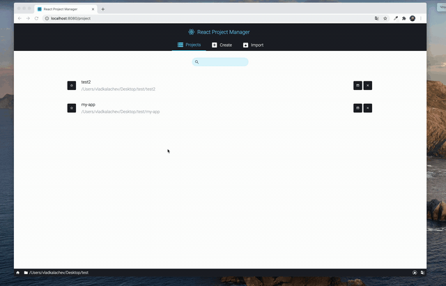

# @react-cli-ui/cli-ui <a href="https://www.npmjs.com/package/@react-cli-ui/cli-ui"></a> <a href="https://www.npmjs.com/package/@react-cli-ui/cli-ui"></a> [](https://lerna.js.org/)

To work with this package please install @ react-cli-ui/cli

> React CLI is the Tooling for React.js Development.

## Install

```bash
Windows
npm install -g @react-cli-ui/cli

Mac
sudo npm install -g @react-cli-ui/cli
```



## Usage

```bash
Windows
react ui

Mac
sudo react ui
```

## License

[MIT](https://choosealicense.com/licenses/mit/)
